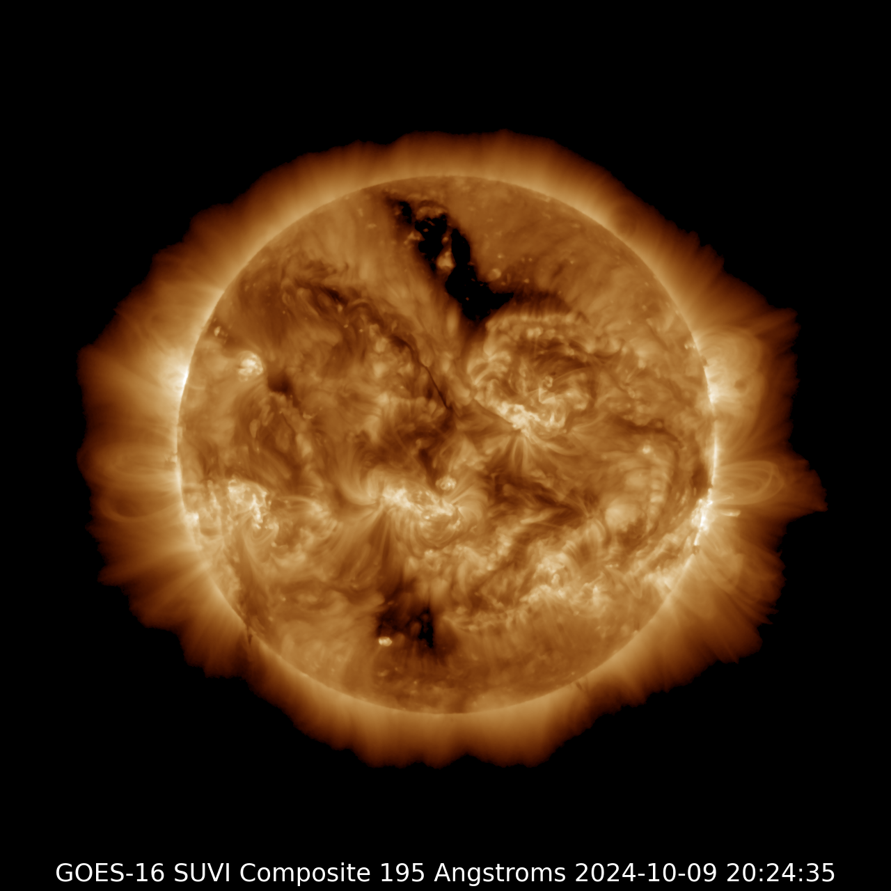
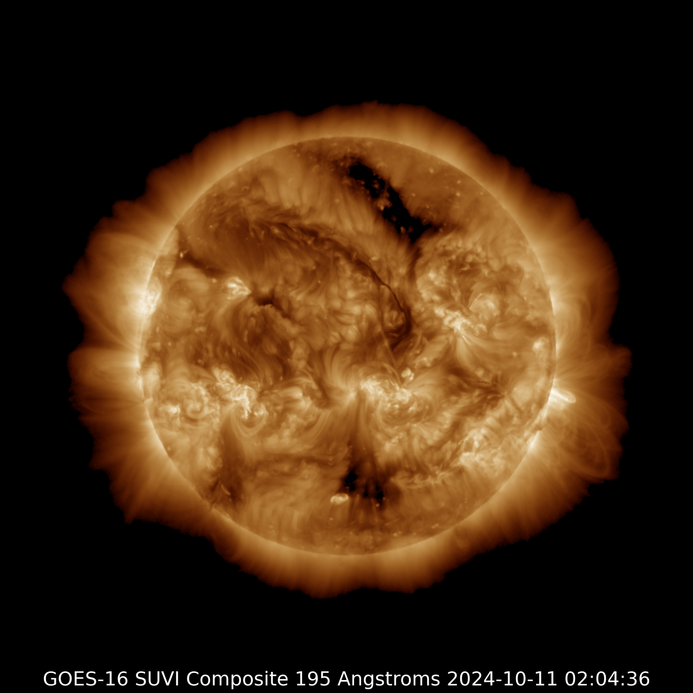
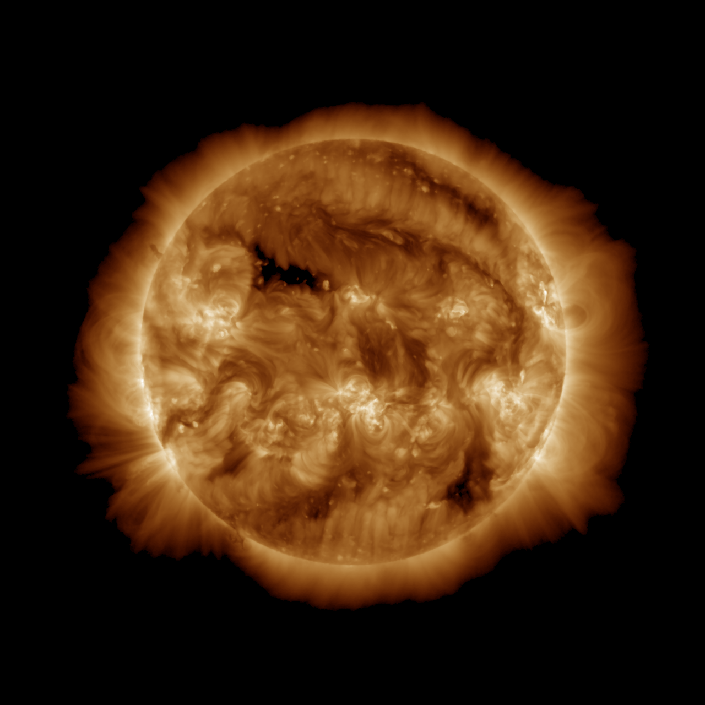

# Exposing the Unseen Layers of the Sun during Solar Disruptions of Oct-2024

- Dare to Dream
- Inspire Bold Leadership
- Embrace Diversity in Thought and Innovation
- Explore & Unveil the Depths of Interplanetary Knowledge

----------------------

This idea introduces an unconventional method for segmenting solar images using advanced techniques to isolate critical features like sunspots and solar flares. By effectively slicing images into meaningful segments, the approach enhances the analysis and interpretation of solar data, improving predictive models of solar activity.

The method not only deepens our understanding of solar phenomena but also holds promise for advancing space weather forecasting and the broader study of astrophysical processes.

<!--_Note: The code was run to generate Solar Slices on my personal MacBook Pro (Retina, Mid 2012)._-->

-----------------------

## Exposing the Unseen Layers of the Sun during Solar Disruptions October 2024

### GOES-16SUVI-2024-10-09-20:24:35

_source: https://www.swpc.noaa.gov/_

---------------
#### Solar Slices from GOES-16SUVI-2024-10-09-20:24:35

<!--_Note: The images below were sliced on my personal MacBook Pro (Retina, Mid 2012)._-->

### GOES-16SUVI-2024-10-11-02:04:36

_source: https://www.swpc.noaa.gov/_

---------------

#### Solar Slices from GOES-16SUVI-2024-10-11-02:04:36

<!--_Note: The images below were sliced on my personal MacBook Pro (Retina, Mid 2012)._-->

### GOES-16SUVI-2024-10-13-16:48:38

_source: https://www.swpc.noaa.gov/_

---------------

#### Solar Slices from GOES-16SUVI-2024-10-13-16:48:38

<!--_Note: The images below were sliced on my personal MacBook Pro (Retina, Mid 2012)._-->

---------------

## "With UnSupervised ML" section (PCA / NMF / ICA / RPCA)

Decomposition layers from **stacking** multiple solar images: each pixel is a small vector across those images, and the methods extract a few patterns as full-frame images.

### PCA

| stack_pca_1 | stack_pca_2 | stack_pca_3 |
|-------------|-------------|-------------|
|  |  |  |

### NMF

| stack_nmf_1 | stack_nmf_2 | stack_nmf_3 |
|-------------|-------------|-------------|
|  |  |  |

### ICA

| stack_ica_1 | stack_ica_2 | stack_ica_3 |
|-------------|-------------|-------------|
|  |  |  |

### Robust PCA (background vs. anomalies)

| stack_rpca_background | stack_rpca_anomalies |
|----------------------|----------------------|
|  |  |

**Files in** `output_slices/` **(stack mode):** `stack_pca_1.png`, `stack_pca_2.png`, `stack_pca_3.png`, `stack_nmf_1.png`, `stack_nmf_2.png`, `stack_nmf_3.png`, `stack_ica_1.png`, `stack_ica_2.png`, `stack_ica_3.png`, `stack_rpca_background.png`, `stack_rpca_anomalies.png`.

---

*Designed by Dang.*
